# ***In [GOLANG](https://go.dev) We Trust***

[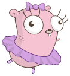](vector/arts/ballet.svg)
[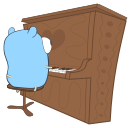](vector/arts/upright.svg)
[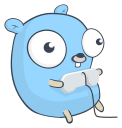](vector/computer/gamer.svg)

[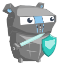](vector/fairy-tale/knight.svg)
[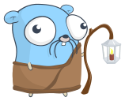](vector/fairy-tale/sage.svg)
[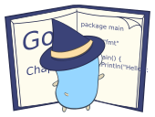](vector/fairy-tale/witch-learning.svg)
[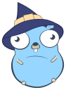](vector/fairy-tale/witch-too-much-candy.svg)
[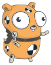](vector/friends/crash-dummy.svg)
[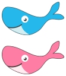](vector/friends/docker.svg)

[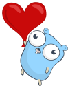](vector/friends/heart-balloon.svg)

[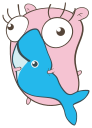](vector/friends/hugging-docker.svg)
[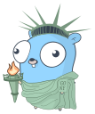](vector/friends/liberty.svg)
[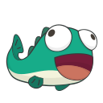](vector/friends/monkfish.svg)

[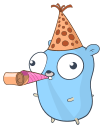](vector/party/birthday.svg)
[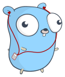](vector/party/music.svg)

[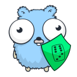](vector/projects/go-fuzz.svg)
[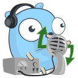](vector/projects/go-grpc-web.svg)

[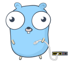](vector/projects/network.svg)
[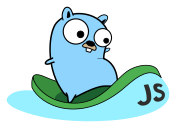](vector/projects/surfing-js.svg)

[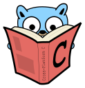](vector/projects/with-C-book.svg)
[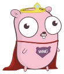](vector/projects/wwgl.svg)
[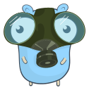](vector/science/gas-mask.svg)
[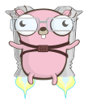](vector/science/jet-pack.svg)
[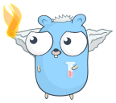](vector/science/mistake.svg)
[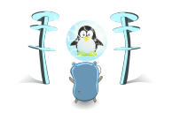](vector/science/power-to-the-linux.svg)
[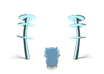](vector/science/power-to-the-mac.svg)
[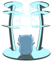](vector/science/power-to-the-masses.svg)
[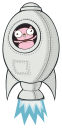](vector/science/rocket.svg)
[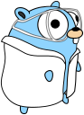](vector/science/scientist.svg)
[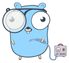](vector/science/soldering.svg)
[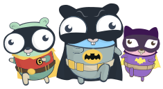](vector/superhero/gotham.svg)

[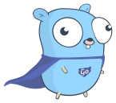](vector/superhero/standing.svg)
[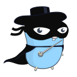](vector/superhero/zorro.svg)

